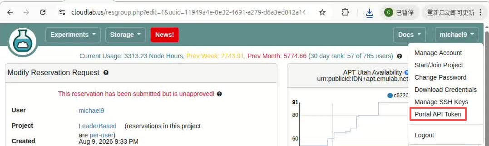

# CloudLab Configuration

This guide describes how to configure `cloudlab_settings.json` before running
the CloudLab deployment commands in the repository's [main README](../README.md).
Run all validation commands below from the repository root.

## Prerequisites

You need:

- a CloudLab/APT account and project; (**If needed, please contact me to obtain a CloudLab account.**)
- a downloaded Portal API token;
- an SSH key registered with the portal; and
- your CloudLab login username.

### How to get your portal API 

1. Sign in to the CloudLab/APT portal that hosts your project.
2. Open the user menu in the upper-right corner, go to the Portal API page, and download your API token.
  
3. Save the downloaded token as `cloudlab.jwt` in the repository root, or choose
   another private location and update `portal.token` accordingly:

   ```json
   "portal": {
     "url": "https://boss.emulab.net:43794",
     "token": "cloudlab.jwt"
   }
   ```


## Configuration Example

Replace the placeholder values in `cloudlab_settings.json` with values for your
account. The following is a complete, valid JSON example for an 11-node APT
allocation containing 10 replicas and one controller:

```json
{
  "portal": {
    "url": "https://boss.emulab.net:43794",
    "token": "cloudlab.jwt",
    "project": "YOUR_PROJECT",
    "profile_name": "manta-nsdi27-ae",
    "profile_project": "YOUR_PROJECT",
    "profile_public": false,
    "profile_project_writable": false,
    "duration_hours": 24,
    "profile_script": "cloudlab/profile.py",
    "experiment_id": "build/portal-experiment-id",
    "experiment_json": "build/portal-experiment.json"
  },
  "experiment": {
    "name": "manta-nsdi27-ae",
    "nodes": 11,
    "node_type": "r320",
    "aggregate": "apt.emulab.net",
    "disk_image": "urn:publicid:IDN+emulab.net+image+emulab-ops//UBUNTU22-64-STD"
  },
  "key": {
    "private": "~/.ssh/cloudlab",
    "pubkey": "~/.ssh/cloudlab.pub"
  },
  "ssh_key_password": "",
  "port": 5000,
  "repo": {
    "name": "manta-nsdi27",
    "url": "https://github.com/michaelwcl323/manta-nsdi27.git",
    "branch": "artifact-evaluation"
  },
  "hosts": [
    {"hostname": "10.10.1.1", "port": 22, "username": "YOUR_CLOUDLAB_USERNAME", "region": "apt"},
    {"hostname": "10.10.1.2", "port": 22, "username": "YOUR_CLOUDLAB_USERNAME", "region": "apt"},
    {"hostname": "10.10.1.3", "port": 22, "username": "YOUR_CLOUDLAB_USERNAME", "region": "apt"},
    {"hostname": "10.10.1.4", "port": 22, "username": "YOUR_CLOUDLAB_USERNAME", "region": "apt"},
    {"hostname": "10.10.1.5", "port": 22, "username": "YOUR_CLOUDLAB_USERNAME", "region": "apt"},
    {"hostname": "10.10.1.6", "port": 22, "username": "YOUR_CLOUDLAB_USERNAME", "region": "apt"},
    {"hostname": "10.10.1.7", "port": 22, "username": "YOUR_CLOUDLAB_USERNAME", "region": "apt"},
    {"hostname": "10.10.1.8", "port": 22, "username": "YOUR_CLOUDLAB_USERNAME", "region": "apt"},
    {"hostname": "10.10.1.9", "port": 22, "username": "YOUR_CLOUDLAB_USERNAME", "region": "apt"},
    {"hostname": "10.10.1.10", "port": 22, "username": "YOUR_CLOUDLAB_USERNAME", "region": "apt"}
  ]
}
```

## Field Reference

### Portal

- `portal.url` is the Portal API endpoint for the active site.
- `portal.token` is a path to the downloaded token file, not the token text.
  The scripts also accept the token through the `PORTAL_TOKEN` environment
  variable.
- `portal.project` is the project charged for the experiment.
- `portal.profile_name` and `portal.profile_project` identify the profile that
  the helper creates or updates.
- `portal.duration_hours` controls the reservation duration.
- `portal.profile_script`, `portal.experiment_id`, and
  `portal.experiment_json` are local paths generated or maintained by the
  helper scripts.

### Experiment

- `experiment.nodes` must be 11 for the full artifact: 10 replicas plus one
  controller. The controller is the final allocated node.
- `experiment.node_type` selects the physical machine type. Leave it empty to
  let CloudLab choose any available raw PC.
- `experiment.disk_image` selects the operating-system image.
- `experiment.aggregate` records the intended site for the operator. The
  current Portal API helper does not use this field to move an allocation;
  portal, project, and profile selection determine the active site.

### SSH and Benchmark Ports

- `key.private` and `key.pubkey` are paths to the local SSH key pair registered
  with CloudLab.
- Set `ssh_key_password` only when the private key is passphrase-protected.
  Leave it as an empty string for an unencrypted key.
- Per-host `port` is the SSH port, normally 22.
- The top-level `port` is the base port used by benchmark services.

### Replica Hosts

`hosts` contains only the 10 replica private-LAN addresses
(`10.10.1.1`–`10.10.1.10`). Do not include the controller
(`10.10.1.11`). Set every `username` to your CloudLab login name. `region` is
the site label used by the orchestration configuration.

The public login hostnames downloaded from the Portal manifests are stored in
`build/nodes`; they are distinct from the private replica addresses in `hosts`.

### Repository

- `repo.name` is the remote checkout directory name.
- `repo.url` is the artifact Git repository.
- `repo.branch` must be `artifact-evaluation` for the evaluation controller.

## Validate the Configuration

First validate the JSON syntax:

```bash
python -m json.tool cloudlab_settings.json >/dev/null
```

Then confirm that the token and SSH key paths exist:

```bash
test -f cloudlab.jwt
test -f ~/.ssh/cloudlab
test -f ~/.ssh/cloudlab.pub
```

If you use different paths in `cloudlab_settings.json`, substitute those paths
in the checks above. After validation, return to the
[remote deployment instructions](../README.md#3-remote-environment-deployment).
